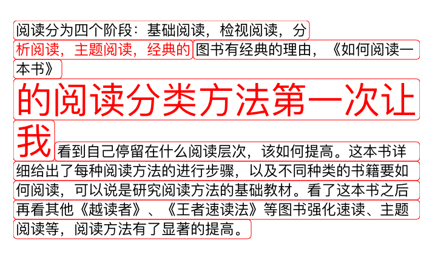
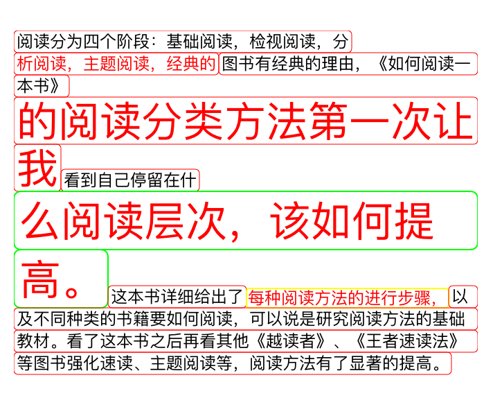

CoreText排版实现标签的效果，在排版过程中你可以自定义如下属性

	// 标签文字的颜色
	NSForegroundColorAttributeName:[UIColor redColor],
	// 标签文字的字体大小
	NSFontAttributeName:[UIFont systemFontOfSize:30],
	// 标签文字是否需要加边框
	CTAttributedStringNeedBorder:@(YES),
	// 标签文字边框宽度
	CTAttributedStringBorderWidth:@(1),
	// 标签文字边框颜色
	CTAttributedStringBorderColor:[UIColor greenColor],
	// 标签文字圆角半径
	CTAttributedStringBorderCornerRadius:@(5),
	// 标签文字边框水平距离边框的边距
	CTAttributedStringBorderHorizonSpacing:@(4),
	// 标签文字边框垂直距离边框的边距
	CTAttributedStringBorderVerticalSpacing:@(6)
	
#### 效果

#### 使用

说了那么多究竟该如何使用呢。直接上代码

	CTDisplayView *displayView = [CTDisplayView new];
	    displayView.frame =CGRectMake(100, 20, CGRectGetWidth(self.view.bounds) - 40, CGRectGetHeight(self.view.bounds) - 200);
	    
	    NSString *content = @"阅读分为四个阶段：基础阅读，检视阅读，分析阅读，主题阅读，经典的图书有经典的理由，《如何阅读一本书》的阅读分类方法第一次让我看到自己停留在什么阅读层次，该如何提高。这本书详细给出了每种阅读方法的进行步骤，以及不同种类的书籍要如何阅读，可以说是研究阅读方法的基础教材。看了这本书之后再看其他《越读者》、《王者速读法》等图书强化速读、主题阅读等，阅读方法有了显著的提高。";
	    CTFrameParserConfig *config = [CTFrameParserConfig new];
	    
	    NSMutableAttributedString *attributedString = [[NSMutableAttributedString alloc] initWithString:content attributes:[CTFrameParser attributesWithConfig:config]];
	    [attributedString addAttributes:@{
	                                      NSForegroundColorAttributeName:[UIColor blackColor],
	                                      NSFontAttributeName:[UIFont systemFontOfSize:12]
	                                      } range:NSMakeRange(0, attributedString.length)];
	    [attributedString addAttributes:@{
	                                      NSForegroundColorAttributeName:[UIColor redColor],
	                                      NSFontAttributeName:[UIFont systemFontOfSize:12],
	                                      CTAttributedStringNeedBorder:@(YES)
	                                      } range:NSMakeRange(20, 12)];
	    
	    [attributedString addAttributes:@{
	                                      NSForegroundColorAttributeName:[UIColor redColor],
	                                      NSFontAttributeName:[UIFont systemFontOfSize:30],
	                                      CTAttributedStringNeedBorder:@(YES)
	                                      } range:NSMakeRange(50, 12)];
	    
	    [attributedString addAttributes:@{
	                                      NSForegroundColorAttributeName:[UIColor redColor],
	                                      NSFontAttributeName:[UIFont systemFontOfSize:30],
	                                      CTAttributedStringNeedBorder:@(YES),
	                                      CTAttributedStringBorderWidth:@(1),
	                                      CTAttributedStringBorderColor:[UIColor greenColor],
	                                      CTAttributedStringBorderCornerRadius:@(5),
	                                      CTAttributedStringBorderHorizonSpacing:@(4),
	                                      CTAttributedStringBorderVerticalSpacing:@(6),
	                                      } range:NSMakeRange(70, 12)];
	    
	    [attributedString addAttributes:@{
	                                      NSForegroundColorAttributeName:[UIColor redColor],
	                                      NSFontAttributeName:[UIFont systemFontOfSize:12],
	                                      CTAttributedStringNeedBorder:@(YES),
	                                      CTAttributedStringBorderWidth:@(1),
	                                      CTAttributedStringBorderColor:[UIColor yellowColor],
	                                      CTAttributedStringBorderCornerRadius:@(2),
	                                      CTAttributedStringBorderHorizonSpacing:@(1),
	                                      CTAttributedStringBorderVerticalSpacing:@(1),
	                                      } range:NSMakeRange(90, 12)];
	    displayView.attributedText = attributedString;
	    displayView.center = self.view.center;
	    displayView.backgroundColor = [UIColor whiteColor];
	    [self.view addSubview:displayView];
	    
#### Tips
该功能的实现有针对性，如果你想在此基础上添加自己的排版方式，可以fork该工程，添加自己需求。这里主要讲述的还是CoreText排版的思想。更多内容[前往]()